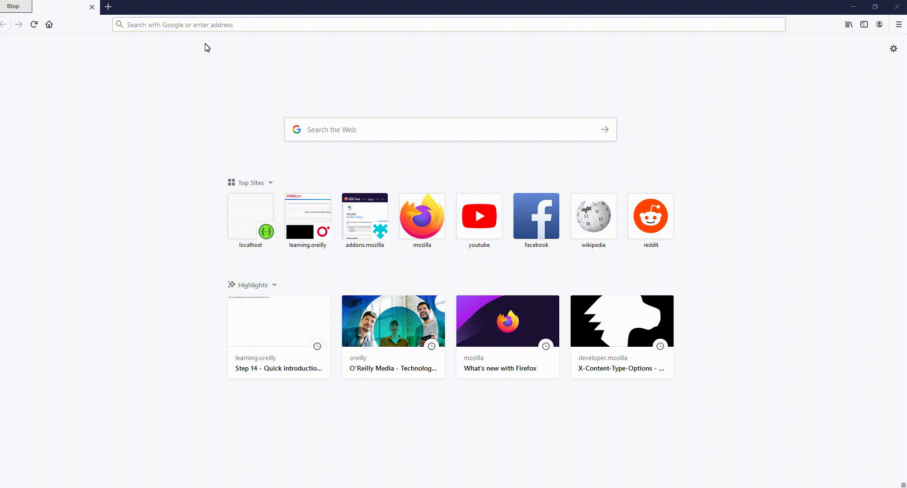

# soap web services with spring boot
## Descriptions
student detail application is the simple start for the developer who want to have a quick start on soap web services.  in this app you can send `getAllStudentDetail` , `GetStudentDetails` , `DeleteStudentDetails` request. this application has a flowing features
 - Simple Exception handing
 - security
 ## Demo
 
 ## Prerequisites
you need to install :
<br/> jdk: 8
<br/> intellij idea <br/>
maven 
you need to install
## some tips  before you start
first step we need to define how our request and response will look like. I created the folder named Example and I define how my response and request will look like in the example folder, file named `request.xml` and `response.xml`. we need to create our xsd file to validate our response and request. in the second step we need to generate the objects that we defied in the xsd file we can do this with the help of the jaxb maven plugin and you must add this to your `pom.xml`. 
```<plugin>  
 <groupId>org.codehaus.mojo</groupId>  
 <artifactId>jaxb2-maven-plugin</artifactId>  
 <version>1.6</version>  
 <executions> <execution> <id>xjc</id>  
 <goals> <goal>xjc</goal>  
 </goals> </execution> </executions> <configuration> <schemaDirectory>${project.basedir}/src/main/resources</schemaDirectory>  
 <outputDirectory>${project.basedir}/src/main/java</outputDirectory>  
 <clearOutputDir>false</clearOutputDir>  
 </configuration> <dependencies> <dependency> <groupId>javax.activation</groupId>  
 <artifactId>activation</artifactId>  
 <version>1.1</version>  
 </dependency> </dependencies></plugin>
 ```
**point about packaging ->** I recomand you to move your `SpringBootApplication` class  out of your default package and paste it in java folder and delete the package you crated before so your project will be without any package and the reason for this is that when you create the objects from xsd file it will be a package base on your definition on xsd file and if you also have a package before, it cause the miss understanding for application context. after objects generated create the same package you remove before and move your `SpringBootApplication` class to this package this package must be sub package of the package that you created from xsd .
for generating objects in intellij move your xsd file to the resources folder click on maven and than clean  and install.
now in the third step after writing endpoint and config finally we can see our service. you need you download wizdler plugin in order to use your soap service after you installed this plugin in Firefox you can access with the address `localhost:8080/ws/student.wsdl` .
in the final step we add security to our soap web service you need to add this dependency in the `pom.xml` if you have any problem for how to authorized your  request see the demo picture 
user name ->user
<br/> password->password
```
<dependency>  
 <groupId>com.sun.xml.wss</groupId>  
 <artifactId>xws-security</artifactId>  
 <version>3.0</version>  
 <exclusions> <exclusion> <groupId>javax.xml.crypto</groupId>  
 <artifactId>xmldsig</artifactId>  
 </exclusion> </exclusions></dependency>  
<dependency>  
 <groupId>javax.activation</groupId>  
 <artifactId>activation</artifactId>  
 <version>1.1.1</version>  
</dependency>
```
## Authors
* **Pooya fils** - *Initial work* - [PooyaFils](https://github.com/pooyafils)
## License
This project is licensed under the MIT License - see the [LICENSE.md](LICENSE.md) file for details
